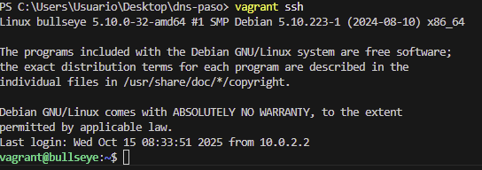
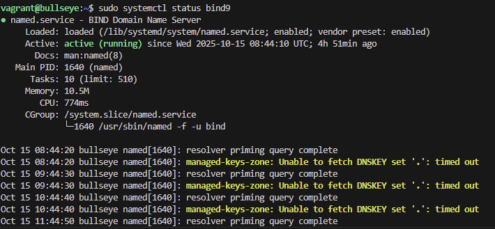
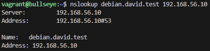

## DNS Paso a Paso

## Creacion de archivos
Tengo que crear lo gitignore para ignorar ciertos comandos y omitir su commit, bootstrap.sh, Vagrantfile.

Iniciar Git: 

Crear Vagrantfile: 

- Añadimos una carpeta config/ que la vamos a utilizar para copiar los archivos necesarios para provisionar el servicio.

## Inicializar repositorio Git
Creo bootstrap.sh: 

## Configuraciones DNS
En config/, tengo que crear 4 ficheros donde tengo que crear las rutas de mi dominio.

- named.conf.options: sirve para saber como se comporta el servidor DNS globalmente, es decir, el DNS BIND9

- named.conf.local: para configurar las zonas (dominios) que el servidor DNS va a gestionar.

- David.test.dns: es un nombre de dominio reservado y no está destinado al uso público en Internet. Es parte del espacio de nombres de prueba de DNS para la creación y pruebas de aplicaciones y sistemas que interactúan con el DNS.

- David.test.rev: Combierte direcciones IP en nombres de dominio.

## Verificar configuraciones
- Voy a verificar los archivos y configuraciones que he hecho recientemente, para ello, tengo que meterme en la maquina virtual con el      comando vagrant ssh  

- Me aseguro que tengo el bind9 corriendo.  

- Apunte importante, he estado horas y horas buscando un error y era que local me estaba buscando una direccion super rara que no habia puesto, supongo que lo habia cogido de la red o algo no lo se, lo he conseguidop arreglar sustituyendolo y poniendolo por las mias. Los sudos que hay en los test si los quito no me funciona porque si los pongo sueltos en la maquina se me queda pillado asi que no se como arrglarlo mejor.

- Con el comando nslookup debian.david.test 192.168.56.10 

## CUESTIONES FINALES

1- ¿Qué pasará si un cliente de una red diferente a la tuya intenta usar tu DNS? ¿Le funcionará? ¿Por qué, en qué parte de la configuración puede verse?

Probablemente no. Tu BIND suele escuchar solo en la red privada y limita quién puede preguntar. Esto se controla en named.conf.options con listen-on { … };, allow-query { … }; y allow-recursion { … }; (a veces con una acl tipo 192.168.56.0/24). Un firewall externo también puede bloquear el 53.

2- ¿Por qué tenemos que permitir las consultas recursivas en la configuración?

Porque si quieres que tu servidor actúe como resolver (no solo autoritativo de tu zona), debe poder seguir cadenas de delegación y traer respuestas completas para tus clientes. Eso se habilita con recursion yes; y se restringe a redes de confianza con allow-recursion.

3- El servidor DNS que acabáis de montar, ¿es autoritativo? ¿Por qué?

Sí, para tu zona (p. ej., david.test) porque defines la zona con type master; y un fichero con SOA/NS. No es autoritativo para el resto de Internet; ahí, si permites recursión, solo resuelve como caché.

4- ¿Dónde podemos encontrar la directiva $ORIGIN y para qué sirve?

En los archivos de zona. Establece el dominio base para expandir nombres relativos (hasta que cambie). Si no se pone, suele implícitamente ser el nombre de la zona.

5- ¿Una zona es idéntica a un dominio?

No. Un dominio es un nombre en la jerarquía DNS. Una zona es la parte del espacio de nombres que administra un servidor con su fichero de zona. Un dominio puede abarcar varias zonas o estar delegado en subzonas.

6- ¿Cuántos servidores raíz existen?
13 identificadores lógicos (A–M) de los root servers. Cada uno tiene muchas instancias anycast distribuidas por el mundo.

7- ¿Qué es una consulta iterativa de referencia?

Una consulta en la que el servidor no resuelve hasta el final, sino que responde con una referencia (registros NS y, si puede, glue A/AAAA) hacia el servidor autoritativo siguiente. El cliente sigue el proceso preguntando a esos servidores.

8- En una resolución inversa, ¿a qué nombre se mapearía la IP 172.16.34.56?

A 56.34.16.172.in-addr.arpa. dentro de la zona inversa correspondiente (16.172.in-addr.arpa o subzonas delegadas como 34.16.172.in-addr.arpa, según la organización de la red).